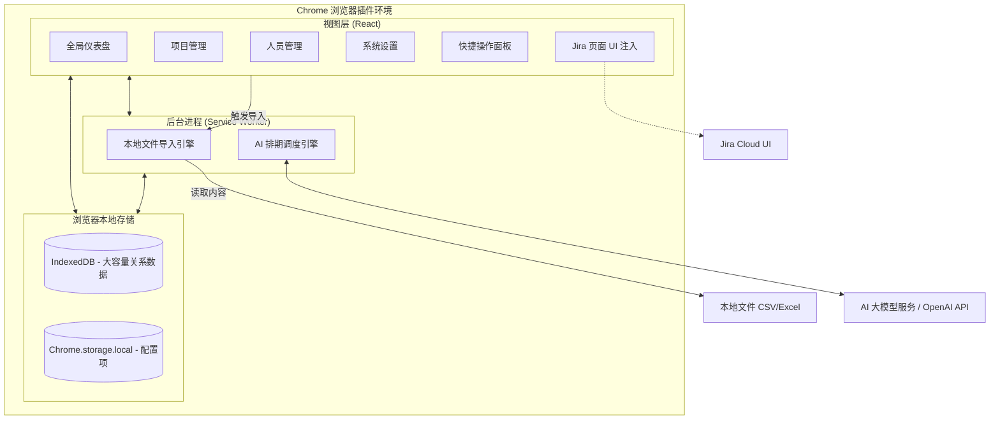
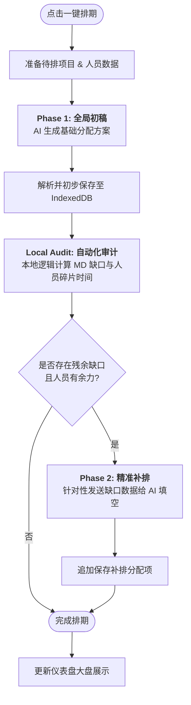

# 智能研发资源排期系统 (Intelligent Resource Planner) - 规划文档

**⚠️ 架构与设计维护说明 (For AI Agents):**
> 任何关于本项目的功能变更、架构调整（如更换数据源、修改核心业务流程）都**必须**同步更新至本文档，确保它始终作为项目设计的 Single Source of Truth。

## 一、 产品需求文档 (PRD)

### 1.1 项目背景与目标
在软件开发过程中，项目经理和资源主管经常面临多项目并行、资源瓶颈难以识别的痛点。尤其是在季度规划时，开发、测试等研发资源的分配需要平衡项目优先级和人员技能。本项目旨在打造一款 AI 辅助的资源排期与预警系统，帮助团队合理调配资源，提前发现过载风险。

### 1.2 目标用户
*   **项目经理 (PM) / 敏捷教练 (Scrum Master)**：负责项目整体排期，监控资源使用情况。
*   **研发主管 / 测试主管 (Resource Managers)**：管理团队成员技能标签，分配具体人员到项目。

### 1.3 核心业务流程
1.  **数据导入 (Manual File Import)**：用户在插件的“项目管理”页面（Projects）通过手动上传 CSV 或 Excel (.xlsx) 文件来导入待排期项目列表。文件包含项目名称、优先级、负责人、预计开发和测试人天等核心信息。
2.  **资源图谱**：主管在插件的独立管理页（Options Page）中维护团队成员在不同产品域的开发/测试能力标签及当前可用性，数据存储在本地。
3.  **智能排期**：在季度规划期间，PM 在插件看板一键触发 AI 排期，插件直接调用大模型 API（如 OpenAI），根据优先级规则、项目工时预估、资源技能标签和当前负荷，推荐排期方案。
4.  **实时预警 (Jira 联动)**：当 PM 浏览 Jira 页面时，插件的 Content Script 实时读取本地缓存的排期数据，在页面上无侵入式注入并提示当前项目指派人的资源超载/闲置风险。

#### 1.4 核心功能模块 (Core Features)

#### 1.4.1 标准角色定义 (Standard Roles)
系统预设以下 5 种标准研发角色，并自动与项目工时评估（MD）进行匹配：
*   **前端工程师 / 后端工程师 / APP工程师**：属于开发力量，主要负责 `devTotalMd`（开发工时）。
*   **全栈工程师**：**属于开发力量**，具有通用性，可同时参与前端或后端的 `devTotalMd` 任务。当开发资源饱和时，也可灵活协助 `testTotalMd`。
*   **测试工程师**：专门负责 `testTotalMd`（测试工时）。

#### 1.4.2 资源缺口与闲置分析 (Gap & Idle Analysis)
排期完成后，系统会自动执行双向审计：
*   **项目视角**：对比项目所需的 `devTotalMd` / `testTotalMd` 与实际排期人天。未获得足额分配的项目（或完全未排期的项目）将进入「待跟进项目」看板。
*   **资源视角**：在选定的时间跨度内，计算人员的可用总工时与已排期工时的差值。未满载（饱和度低于 100%）的人员将进入「待补充任务」看板。

#### 1.4.3 项目分类管理 (Project Categorization)
为了确保排期的有效性，系统将项目分为两类：
*   **待排期项目 (Ready for AI)**：已填写 `devTotalMd` 或 `testTotalMd` 的项目。这类项目会参与 AI 智能排期计算，并出现在资源分配大盘中。
*   **待评估项目 (Pending Assessment)**：尚未评估工时（MD 为 0）的项目。这类项目不参与 AI 排期，但会展示在大盘底部的独立清单中，提醒 PM 及时跟进评估。

*   **项目管理 (Project Management)**：独立页面，展示所有待排期项目的详细清单（项目名、负责人、起止日期、评估工时等），并支持按优先级从高到低自动排序。
*   **智能排期引擎 (AI Scheduler)**：纯前端组装 Prompt，支持用户配置自定义 API Base URL 和模型名称，兼容 OpenAI 协议（如 DeepSeek, Qwen, Claude 等）。
*   **资源图谱与技能管理**：本地化的人员画像管理。
*   **本地文件导入 (CSV/XLSX Import)**：支持通过手动上传 CSV 或 Excel 批量导入项目，系统会自动执行全量覆盖更新。
*   **Jira 预警机制 (Alerts)**：对资源超量分配进行红绿灯预警，并在 Jira 原生 Issue 页面中悬浮展示。

---

## 二、 系统架构图 (Local-first Chrome Extension Architecture)

本系统采用纯客户端（Local-first）架构，所有数据存储在用户的浏览器本地缓存中，无独立后端服务器。

---

## 三、 关键技术方案 (Key Technical Solutions)

#### 3.3.1 本地文件导入与项目管理
*   **优先级逻辑**：系统严格遵循「从上到下」的物理顺序规则。文件导入时，排在顶部的项目具有最高优先级。
*   **展示与排期一致性**：无论是「项目管理」页面的列表展示，还是「全局排期大盘」的 AI 自动排期，都统一使用数据库自增 ID 作为顺序基准，确保 UI 显示顺序、业务优先级顺序与 AI 逻辑完全对齐。

#### 3.3.2 多阶段迭代排期架构 (Iterative AI Scheduling)
为了解决单次调用 AI 容易产生的漏排、少排问题，系统采用「初稿 -> 审计 -> 补排」的迭代架构：

1.  **Drafting Phase (初稿)**：AI 根据全局数据生成第一版分配方案，优先满足高优先级项目的核心工时。
2.  **Hard-coded Audit (硬审计)**：系统利用本地代码逻辑，精确计算各项目的剩余 MD 缺口及各资源的碎片化空闲时间。
3.  **Refinement Phase (补排)**：将审计出的「残余缺口」与「闲置资源」再次发送给 AI，执行专项补排指令，消除分配盲区。

#### 3.3.3 月度资源投入计算 (Monthly Allocated MD Calculation)
*   **基准年份**：系统当前以 **2026 年** 为基准年份进行所有排期和计算。
*   **最小排期单位**：系统以 **1 天 (Integer)** 为最小排期和展示单位。
*   **取整规则**：所有排期生成的人天、月度统计及审计差值均进行四舍五入取整，不保留小数点，确保排期结果符合实际执行习惯。
*   **工作日逻辑**：计算必须排除周末，并能够识别和扣除法定节假日（如清明节、劳动节等）。
*   **动态计算公式**：`月度投入人天 = 该月内项目重叠的工作日天数 * 投入占比 %`。

#### 3.3.4 Content Script 预警注入
*   插件的 Content Script 会监听页面 DOM 变化（特别是 Jira 的 `[data-testid="issue.views.field.user.assignee"]` 元素）。
*   当识别到具体的处理人姓名时，异步查询 IndexedDB 计算其当前所有进行中项目分配累加的负荷百分比。
*   将负荷情况以不侵入原有 DOM 结构的方式，在页面右下角以红/黄/绿悬浮卡片展示预警。
