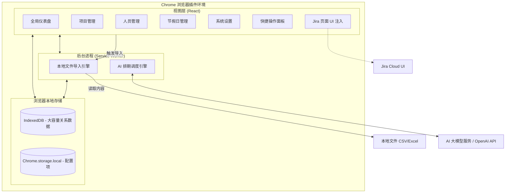
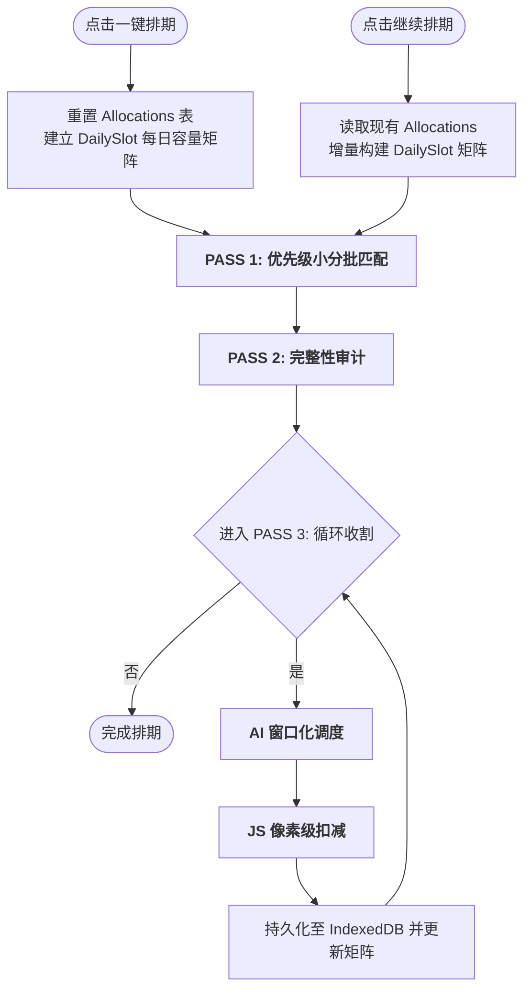

# 智能研发资源排期系统 (Intelligent Resource Planner) - 规划文档

**⚠️ 架构与设计维护说明 (For AI Agents):**
> 任何关于本项目的功能变更、架构调整（如更换数据源、修改核心业务流程）都**必须**同步更新至本文档，确保它始终作为项目设计的 Single Source of Truth。

## 一、 产品需求文档 (PRD)

### 1.1 项目背景与目标
在软件开发过程中，项目经理和资源主管经常面临多项目并行、资源瓶颈难以识别的痛点。尤其是在季度规划时，开发、测试等研发资源的分配需要平衡项目优先级和人员技能。本项目旨在打造一款 AI 辅助的资源排期与预警系统，帮助团队合理调配资源，提前发现过载风险。

### 1.2 目标用户
*   **项目经理 (PM) / 敏捷教练 (Scrum Master)**：负责项目整体排期，监控资源使用情况。
*   **研发主管 / 测试主管 (Resource Managers)**：管理团队成员技能标签，分配具体人员到项目。

### 1.3 核心业务流程
1.  **数据导入 (Manual File Import)**：用户在插件的“项目管理”页面（Projects）通过手动上传 CSV 或 Excel (.xlsx) 文件来导入待排期项目列表。
    * 页面提供了**「下载模板 (CSV)」**功能，方便用户获取包含标准表头的样例文件。
    * 系统通过智能表头匹配提取以下核心信息：项目名称、业务方、优先级、状态、各项负责人 (Digital Responsible, Tech Lead, Quality Lead)、起止及上线时间、预估的开发/测试总人天 (Total MD) 以及具体的任务明细 (Details Product MD) 和技术域 (Tech Stack, Domain)。
2.  **资源图谱**：主管在插件的独立管理页（Options Page）中维护团队成员在不同产品域的开发/测试能力标签及当前可用性，数据存储在本地。
    * 支持通过手动上传 CSV 或 Excel 批量导入团队成员。
    * 提供包含标准角色与技能标签的下载模板。
    * 支持将当前人员列表导出为 CSV 文件。
3.  **智能排期**：在季度规划期间，PM 在插件看板一键触发 AI 排期，插件直接调用大模型 API（如 OpenAI），根据优先级规则、项目工时预估、资源技能标签和当前负荷，推荐排期方案。
4.  **实时预警 (Jira 联动)**：当 PM 浏览 Jira 页面时，插件的 Content Script 实时读取本地缓存的排期数据，在页面上无侵入式注入并提示当前项目指派人的资源超载/闲置风险。

#### 1.4 核心功能模块 (Core Features)

#### 1.4.1 标准角色定义 (Standard Roles)
系统预设以下 5 种标准研发角色，并自动与项目工时评估（MD）进行匹配：
*   **前端工程师 / 后端工程师 / APP工程师**：属于开发力量，主要负责 `devTotalMd`（开发工时）。
*   **全栈工程师**：**属于开发力量**，具有通用性，可灵活参与前端或后端的 `devTotalMd` 任务。全栈工程师只负责开发，不参与测试工作。
*   **测试工程师**：专门负责 `testTotalMd`（测试工时）。

#### 1.4.2 资源缺口与闲置分析 (Gap & Idle Analysis)
排期完成后，系统会自动执行双向审计：
*   **项目视角**：对比项目所需的 `devTotalMd` / `testTotalMd` 与实际排期人天。未获得足额分配的项目（或完全未排期的项目）将进入「待跟进项目」看板。
*   **资源视角**：在选定的时间跨度内，计算人员的可用总工时与已排期工时的差值。未满载（饱和度低于 100%）的人员将进入「待补充任务」看板。

#### 1.4.3 项目分类管理 (Project Categorization)
为了确保排期的有效性，系统将项目分为两类：
*   **待排期项目 (Ready for AI)**：已填写 `devTotalMd` 或 `testTotalMd` 的项目。这类项目会参与 AI 智能排期计算，并出现在资源分配大盘中。
*   **待评估项目 (Pending Assessment)**：尚未评估工时（MD 为 0）的项目。这类项目不参与 AI 排期，但会展示在大盘底部的独立清单中，提醒 PM 及时跟进评估。

#### 1.4.4 节假日与日历可配置 (Configurable Holiday Calendar)
*   **日历管理**：独立页面，允许用户自定义法定节假日（休息日）和调休工作日（周末上班）。
*   **动态排期计算**：系统内置默认日历数据，修改后立即持久化到本地 IndexedDB，AI 智能排期和 `endDate` 推算将严格遵守最新的自定义日历设置。

*   **项目管理 (Project Management)**：独立页面，展示所有待排期项目的详细清单（项目名、负责人、起止日期、评估工时等），并支持按优先级从高到低自动排序。
*   **智能排期引擎 (AI Scheduler)**：纯前端组装 Prompt，支持用户配置自定义 API Base URL 和模型名称，兼容 OpenAI 协议（如 DeepSeek, Qwen, Claude 等）。
*   **资源图谱与技能管理**：本地化的人员画像管理。
*   **技能标签管理 (Skills Management)**：独立页面，管理团队的「业务领域能力」与「技术能力」标签。
    *   **业务领域**：如 Order, Stock, Fulfillment, Transaction, Checkout & Payment, POS 等。
    *   **技术技能**：如 AI Coding, Automation Test, Big Data, Data Quality, App 等。
    *   支持标签的 CRUD 操作，并支持通过 CSV 批量导入/导出技能标签，为 AI 智能匹配提供标准化的维度。
*   **本地文件导入 (CSV/XLSX Import)**：支持通过手动上传 CSV 或 Excel 批量导入项目，系统会自动执行全量覆盖更新。
*   **Jira 预警机制 (Alerts)**：对资源超量分配进行红绿灯预警，并在 Jira 原生 Issue 页面中悬浮展示。

---

## 二、 系统架构图 (Local-first Chrome Extension Architecture)

本系统采用纯客户端（Local-first）架构，所有数据存储在用户的浏览器本地缓存中，无独立后端服务器。

---

## 三、 关键技术方案 (Key Technical Solutions)

#### 3.3.1 本地文件导入与项目管理
*   **优先级逻辑**：系统严格遵循「从上到下」的物理顺序规则。文件导入时，排在顶部的项目具有最高优先级。
*   **展示与排期一致性**：无论是「项目管理」页面的列表展示，还是「全局排期大盘」的 AI 自动排期，都统一使用数据库自增 ID 作为顺序基准，确保 UI 显示顺序、业务优先级顺序与 AI 逻辑完全对齐。

#### 3.3.2 时间槽位矩阵统筹与收敛循环 (Time Slot Matrix & Convergence Loops)
系统已进化至统筹大师级调度架构，通过「像素级」建模和「贪心循环」实现资源利用率的极致挖掘：

1.  **DailySlot 每日容量建模**：系统为每位员工在排期窗口内建立完整的日历矩阵。每一天都是一个独立的调度单元，精确记录 `usedCapacity`。
2.  **增量调度支持 (Continue Scheduling)**：系统新增「继续排期」功能。与传统的全量覆盖不同，该模式会保留数据库中已有的分配方案，将其视为不可动的“时间槽位”并增量构建日历矩阵。这使得用户可以分批次导入项目并进行追加调度，而不破坏已达成的排期共识。
3.  **高性能内存矩阵 (Incremental Shared Matrix)**：矩阵状态在调度会话中增量维护。每当一条 AI 建议被应用，系统仅针对受影响的人员做局部 Slot 更新，消除了在循环内触发全量审计的性能瓶颈。
4.  **O(1) 级算法优化**：
    *   **集合化查询**：节假日与调休日列表在初始化时即转为 `Set` 结构，确保每日状态判定的时间复杂度为 O(1)。
    *   **工作日预计算**：系统在排期启动前一次性预生成排期窗口内的完整工作日集合，后续所有 MD 推算和 `endDate` 计算均直接查表。
5.  **AI 窗口化感知 (Windowed Awareness)**：传给 AI 精确的 `Available Windows` 列表。针对 Token 成本，系统会自动裁剪过长的日历摘要（截断为最近 3 个空闲窗口）。
6.  **收敛收割循环 (Convergence Loops)**：最后的收割阶段执行最多 3 轮的贪心补排，直到分配结果达到数学意义上的收敛。
7.  **排期完整性回滚 (All-or-Nothing Rollback)**：强制执行事务检查。若项目无法完成“研发+测试”闭环，或开发分配严重欠配（<50%）且测试完全未排，则果断释放占位资源。
8.  **毫秒级响应中断 (Aggressive Interruption)**：通过 `AbortController` 实现，点击停止后会立即取消正在进行的 AI 异步请求及后续处理。
9.  **全链路精度保持**：内部计算（缺口、闲置、分配额）全程采用浮点数传递，仅在最终写入数据库和 UI 展现时进行四舍五入，杜绝累积偏差。

#### 3.3.3 排期精准度与策略优化 (Scheduling Precision & Strategies)
为提升 AI 分配的合理性与资源利用率，系统在底层引入了多项高级调度特性：
1. **两阶段分离排期 (Two-Phase Scheduling)**：将排期严格划分为 `Dev-first` 和 `Test-second` 两个阶段。优先分配开发资源（含全栈），随后系统根据该项目所有开发任务的最早开始和最晚结束时间，动态计算出时间中点（Midpoint），以此作为测试人员的最早介入日期，彻底解决测试资源过早锁定、空等交付的问题。
2. **多维度特征匹配 (Multi-dimensional Matching)**：CSV 导入支持读取 `techStack`（技术栈）和 `domain`（产品域）等上下文信息。AI 微调度时会执行交叉比对，优先匹配「技能标签」对口的候选人。
3. **动态排期策略模板 (Strategy Templates) 与自定义 Prompt**：
   * **专注模式 (Focused)**：默认模式，倾向于安排 100% 投入，单线程快速击穿项目。
   * **均衡模式 (Balanced)**：引入时间切片概念，建议 50% 的投入占比，以支持资源进行多项目并行。
   * **反碎片化约束 (Anti-Fragmentation)**：系统强制要求 AI 减少项目拆解。每个任务建议至少分配 3 天（除非缺口不足），且每个项目的每个阶段原则上不超过 2 名负责人，以降低沟通成本并保证项目交付的连续性。
   * **负责人强制锁定 (Mandatory Leads)**：系统会自动识别项目定义的「技术负责人」与「质量负责人」。如果该负责人在资源库中且有闲置时间，AI 将被强制要求将其排入该项目，并确保其占有合理的投入比例。
   * **基于明细的技能匹配 (Detail-based Matching)**：AI 会深度解析 `Details Product DEV/TEST MD` 字段中的具体产品明细，优先匹配具备相关业务领域知识或技术能力的研发人员。
   * **紧急模式 (Urgent)**：允许满负荷或超负荷加班分配，以确保最高优项目快速推进。
   * **自定义排期指令 (Editable Prompt)**：在系统设置页面，用户可以自由修改 AI 的核心决策 Prompt。通过自定义 Prompt，团队可以轻松扩展独有的业务分配准则（例如：禁止全栈接手核心前端项目等），且一键 支持重置回系统默认逻辑。
4. **严格排期窗口约束与防死循环 (Strict Scheduling Window & Early Exit)**：用户的排期时间选择区间（如 4月至6月）即为绝对物理边界。
   * 系统的实际推算如果越过该窗口的最后一天（如 6月30日），则会触发「硬截断」甚至直接放弃分配，退回为项目缺口。
   * **Token 防浪费优化**：当某个角色的排期时间已超出 6月份边界后，系统会自动将其从候选池中移除；如果大盘中所有对应资源均已耗尽或越界，排班系统会直接熔断并停止向 AI 引擎发送后续低优先级项目的空请 求，从而避免 Token 浪费与死循环。
5. **测试前置依赖推算 (Test Dependency)**：在 Prompt 层与代码层双重约束，确保同一个项目的测试任务逻辑上绝对不会早于开发任务。系统会动态识别项目开发任务的「最早开始时间」作为测试的最早准入日期，支 持测试与开发同步并行，最大化资源利用率。
6. **AI 返回结果合法性校验 (Schema Validation)**：在解析 AI 建议时，系统会强制执行 Schema 校验，过滤掉 `projectId`/`resourceId` 缺失、分配人天小于 1 或百分比异常的非法条目，确保调度逻辑的鲁棒性。

#### 3.3.4 月度资源投入计算 (Monthly Allocated MD Calculation)
*   **基准年份**：系统当前以 **2026 年** 为基准年份进行所有排期和计算。
*   **最小排期单位**：系统以 **1 天 (Integer)** 为最小排期和展示单位。
*   **取整规则**：所有排期生成的人天、月度统计及审计差值均进行四舍五入取整，不保留小数点，确保排期结果符合实际执行习惯。
*   **工作日逻辑**：计算必须排除周末，并能够识别和扣除法定节假日（如清明节、劳动节等）。
*   **动态计算公式**：`月度投入人天 = 该月内项目重叠的工作日天数 * 投入占比 %`。

#### 3.3.5 数据展示与大盘增强 (Dashboard Enhancements)
*   **已排项目概览**：在排期详情上方新增「已排项目」看板，自动筛选出开发与测试资源均已分配到位的项目。该视图集中展示项目的技术负责人、质量负责人以及最终投入的所有研发人员清单。
*   **双向统计视图**：支持按「人员维度」查看负荷分布，或按「项目维度」查看资源组成。
*   **实时缺口审计**：动态展示仍有工时缺口的项目及其具体缺失的 MD 天数。

#### 3.3.6 Content Script 预警注入
*   插件的 Content Script 会监听页面 DOM 变化（特别是 Jira 的 `[data-testid="issue.views.field.user.assignee"]` 元素）。
*   当识别到具体的处理人姓名时，异步查询 IndexedDB 计算其当前所有进行中项目分配累加的负荷百分比。
*   将负荷情况以不侵入原有 DOM 结构的方式，在页面右下角以红/黄/绿悬浮卡片展示预警。

#### 3.3.7 开源协议 (License)
本项目采用 **MIT 开源协议**，允许用户自由地使用、修改和分发代码，确保了工具的开放性与社区共享精神。

#### 3.3.8 调度引擎性能与准确性优化 (Scheduling Engine Optimization)
为提升大规模项目排期的响应速度与结果的业务合理性，系统在 v1.0.3 版本中引入了以下深度优化方案：
1. **增量矩阵更新 (Incremental Matrix Update)**：废弃了每条 AI 建议后执行全量审计的逻辑。现在系统维护一份常驻内存的 `DailySlot` 状态 Map，应用建议时仅针对受影响的人员进行局部“像素级”扣减，将单次建议的应用耗时降低了 90% 以上。
2. **Set 化 O(1) 查找**：将节假日与调休日列表在模块加载时即转为 `Set<string>` 结构。所有的 `isWorkingDay` 判定从数组遍历改进为常数时间查找，显著提升了排期时间跨度较长时的推算效率。
3. **测试准入逻辑修正**：对齐业务真实交付场景，将测试的最早准入日期从「开发开始日」修正为「开发时间跨度中点 (Midpoint)」。这有效减少了测试资源在开发初期的无效占用，显著提升了测试侧的资源利用率。
4. **AI 响应鲁棒性校验**：在解析 AI 返回的 JSON 建议时，强制执行 Schema 校验。自动过滤掉 `allocatedMd < 1` 或百分比超出合理范围的非法条目，并对非法结果进行控制台预警，确保了调度结果的数学正确性。
5. **实时请求中断 (AbortController)**：引入了 `AbortController` 机制。当用户点击“停止排期”时，系统会立即切断正在进行的 fetch 请求并熔断后续的异步处理流，实现了真正的“毫秒级”响应式中断。
6. **Token 消耗裁剪**：通过对传给 AI 的 `scheduleSummary` 进行长度动态截断（仅保留最近 3 个空闲窗口），在不丢失关键调度信息的前提下，大幅缩减了 Context Window 的 Token 占用。
7. **工作日集合预计算**：排期启动前一次性预生成窗口内的工作日集合，替代了循环内重复的日期对象创建与判定，进一步压低了 CPU 负载。

#### 3.3.9 统一报错反馈机制 (Unified Error Feedback Mechanism)
为提供更加专业且友好的交互体验，系统封装了标准的 **ErrorModal** 通用组件，并作为全系统的错误处理标准：
1. **图层模态化**：弃用了系统原始的 `window.alert()`，改用基于 Tailwind CSS 实现的半透明磨砂背景（Backdrop Blur）模态框。
2. **结构化展示**：报错窗口分为“醒目标题”、“业务友好说明”及“技术原始详情”三个层次。特别是 `errorDetails` 区域，支持对导入失败的堆栈信息或 API 异常进行展示，方便用户自助排查。
3. **闭环日志**：所有 UI 层的报错均会在 Console 同步输出，实现了“用户可感知、技术可追踪”的闭环反馈。

#### 3.3.10 数据持久化稳定性保障 (Data Persistence Stability)
针对 Chrome 插件特有的运行环境，系统在底层引入了多重稳定性加固措施：
1. **稳定存储原点 (Storage Origin)**：通过在 `manifest.json` 中注入固定的公钥 `key`，确保了插件在不同构建版本和开发环境下的 Extension ID 保持恒定。这有效避免了因 Origin 变化导致的 `chrome.storage.local` 设置丢失和 IndexedDB 数据库重置。
2. **累进式 Schema 维护**：在 Dexie.js 的版本演进逻辑中，强制要求每个新增版本必须完整定义全量数据表。这杜绝了 Dexie 默认的“未定义即删除”行为，确保了在引入新功能（如技能管理）时，历史数据（如项目、资源）能够被安全继承。

#### 3.3.11 产品运维基石排期 (Product Operations Scheduling)
为保障存量产品的平稳运行，系统在 v1.0.3 版本中引入了「产品运维管理」模块，并在排期引擎的最前端增加了 **PASS 0（阶段零）** 逻辑：
1. **优先保障与按月平摊机制**：在 AI 接手任何高优业务项目（PASS 1）之前，系统会率先通过代码硬逻辑直接扣减配置好的每月运维研发与测试人天。**系统会按月（Month-by-month）独立遍历与分配，严格限制单次分配的起始与结束时间在当月物理边界内**，彻底杜绝了多月人天堆积在第一个月、导致资源瞬间过载的问题。
2. **智能“好资源”保护**：在挑选运维人员时，系统会自动扫描当前所有待排期项目，将在项目中被提名为“技术负责 (Tech Lead)”或“质量负责 (Quality Lead)”的人员隔离保护。运维任务将优先分配给同样具备该产品技能标签，但未承担核心 Leader 角色的“基本资源”，从而将精英战力留给后续的攻坚项目。
3. **技能自动生成联动**：当用户通过 UI 手动添加或通过 CSV 批量导入新的产品运维配置时，系统会自动检查该产品名称是否存在于“技能管理”字典中。若不存在，系统会自动将其创建为一个新的“业务 (business)”标签，方便项目经理快速为人员打上对应的产品技能标签，消除重复录入的繁琐。
4. **零 Token 消耗**：PASS 0 完全基于本地策略演算，无需请求大模型 API，在实现复杂业务意图的同时保证了极高的运行效率和零成本。
5. **可视化大盘区分**：分配给运维任务的人天在全局看板中会以绿色的 `[运维] Product Name` 独立标识，直观区分于正常的业务需求开发。
