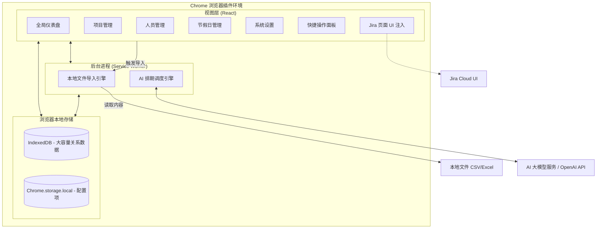

# 智能研发资源排期系统 (Intelligent Resource Planner) - 规划文档

**⚠️ 架构与设计维护说明 (For AI Agents):**
> 任何关于本项目的功能变更、架构调整（如更换数据源、修改核心业务流程）都**必须**同步更新至本文档，确保它始终作为项目设计的 Single Source of Truth。

## 一、 产品需求文档 (PRD)

### 1.1 项目背景与目标
在软件开发过程中，项目经理和资源主管经常面临多项目并行、资源瓶颈难以识别的痛点。尤其是在季度规划时，开发、测试等研发资源的分配需要平衡项目优先级和人员技能。本项目旨在打造一款 AI 辅助的资源排期与预警系统，帮助团队合理调配资源，提前发现过载风险。

### 1.2 目标用户
*   **项目经理 (PM) / 敏捷教练 (Scrum Master)**：负责项目整体排期，监控资源使用情况。
*   **研发主管 / 测试主管 (Resource Managers)**：管理团队成员技能标签，分配具体人员到项目。

### 1.3 核心业务流程
1.  **数据导入 (Manual File Import)**：用户在插件的“项目管理”页面（Projects）通过手动上传 CSV 或 Excel (.xlsx) 文件来导入待排期项目列表。
    * 页面提供了**「下载模板 (CSV)」**功能，方便用户获取包含标准表头的样例文件。
    * 系统通过智能表头匹配提取以下核心信息：项目名称、业务方、优先级、状态、各项负责人 (Digital Responsible, Tech Lead, Quality Lead)、起止及上线时间、预估的开发/测试总人天 (Total MD) 以及具体的任务明细 (Details Product MD) 和技术域 (Tech Stack, Domain)。
2.  **资源图谱**：主管在插件的独立管理页（Options Page）中维护团队成员在不同产品域的开发/测试能力标签及当前可用性，数据存储在本地。
3.  **智能排期**：在季度规划期间，PM 在插件看板一键触发 AI 排期，插件直接调用大模型 API（如 OpenAI），根据优先级规则、项目工时预估、资源技能标签和当前负荷，推荐排期方案。
4.  **实时预警 (Jira 联动)**：当 PM 浏览 Jira 页面时，插件的 Content Script 实时读取本地缓存的排期数据，在页面上无侵入式注入并提示当前项目指派人的资源超载/闲置风险。

#### 1.4 核心功能模块 (Core Features)

#### 1.4.1 标准角色定义 (Standard Roles)
系统预设以下 5 种标准研发角色，并自动与项目工时评估（MD）进行匹配：
*   **前端工程师 / 后端工程师 / APP工程师**：属于开发力量，主要负责 `devTotalMd`（开发工时）。
*   **全栈工程师**：**属于开发力量**，具有通用性，可灵活参与前端或后端的 `devTotalMd` 任务。全栈工程师只负责开发，不参与测试工作。
*   **测试工程师**：专门负责 `testTotalMd`（测试工时）。

#### 1.4.2 资源缺口与闲置分析 (Gap & Idle Analysis)
排期完成后，系统会自动执行双向审计：
*   **项目视角**：对比项目所需的 `devTotalMd` / `testTotalMd` 与实际排期人天。未获得足额分配的项目（或完全未排期的项目）将进入「待跟进项目」看板。
*   **资源视角**：在选定的时间跨度内，计算人员的可用总工时与已排期工时的差值。未满载（饱和度低于 100%）的人员将进入「待补充任务」看板。

#### 1.4.3 项目分类管理 (Project Categorization)
为了确保排期的有效性，系统将项目分为两类：
*   **待排期项目 (Ready for AI)**：已填写 `devTotalMd` 或 `testTotalMd` 的项目。这类项目会参与 AI 智能排期计算，并出现在资源分配大盘中。
*   **待评估项目 (Pending Assessment)**：尚未评估工时（MD 为 0）的项目。这类项目不参与 AI 排期，但会展示在大盘底部的独立清单中，提醒 PM 及时跟进评估。

#### 1.4.4 节假日与日历可配置 (Configurable Holiday Calendar)
*   **日历管理**：独立页面，允许用户自定义法定节假日（休息日）和调休工作日（周末上班）。
*   **动态排期计算**：系统内置默认日历数据，修改后立即持久化到本地 IndexedDB，AI 智能排期和 `endDate` 推算将严格遵守最新的自定义日历设置。

*   **项目管理 (Project Management)**：独立页面，展示所有待排期项目的详细清单（项目名、负责人、起止日期、评估工时等），并支持按优先级从高到低自动排序。
*   **智能排期引擎 (AI Scheduler)**：纯前端组装 Prompt，支持用户配置自定义 API Base URL 和模型名称，兼容 OpenAI 协议（如 DeepSeek, Qwen, Claude 等）。
*   **资源图谱与技能管理**：本地化的人员画像管理。
*   **本地文件导入 (CSV/XLSX Import)**：支持通过手动上传 CSV 或 Excel 批量导入项目，系统会自动执行全量覆盖更新。
*   **Jira 预警机制 (Alerts)**：对资源超量分配进行红绿灯预警，并在 Jira 原生 Issue 页面中悬浮展示。

---

## 二、 系统架构图 (Local-first Chrome Extension Architecture)

本系统采用纯客户端（Local-first）架构，所有数据存储在用户的浏览器本地缓存中，无独立后端服务器。



---

## 三、 关键技术方案 (Key Technical Solutions)

#### 3.3.1 本地文件导入与项目管理
*   **优先级逻辑**：系统严格遵循「从上到下」的物理顺序规则。文件导入时，排在顶部的项目具有最高优先级。
*   **展示与排期一致性**：无论是「项目管理」页面的列表展示，还是「全局排期大盘」的 AI 自动排期，都统一使用数据库自增 ID 作为顺序基准，确保 UI 显示顺序、业务优先级顺序与 AI 逻辑完全对齐。

#### 3.3.2 优先级小批量排期与完整性回滚 (Priority Mini-Batches & Integrity Rollback)
为了在「全局分配」和「严格优先级」之间取得最佳平衡，并解决独立排期可能产生的“半拉子工程”问题，系统架构升级为带事务特性的批量排期模型：

```mermaid
graph TD
    Start([点击一键排期]) --> Init[重置 Allocations 表<br/>建立资源池与需求池]
    Init --> LoopStart{按物理顺序切分为 3个/组 的小批次}
    
    LoopStart --> CheckEnd{所有批次已处理完毕?}
    CheckEnd -- 是 --> AuditPhase[<b>完整性审计 (Integrity Audit)</b><br/>扫描是否存在只有 Dev 没有 Test 的半拉子项目]
    
    AuditPhase --> HasRollback{是否存在脱节项目?}
    HasRollback -- 是 --> Rollback[触发整体回滚: 撤销该项目所有分配, 退回人天] --> End([完成排期])
    HasRollback -- 否 --> End
    
    CheckEnd -- 否 --> BatchAI[<b>小批量微调度 (Mini-Batch Matching)</b><br/>应用 Prompt Caching 分阶段发送 Dev 和 Test 请求]
    
    BatchAI --> HardDeduction[<b>JS 强制截断与扣减</b><br/>遍历返回结果，实际分配人天 = Math.min(AI建议, 缺口, 资源余量)]
    HardDeduction --> CalculateDates[基于项目与人员情况计算真实起止日期]
    CalculateDates --> Save[持久化至 IndexedDB 并触发 UI 更新]
    
    Save --> LoopStart
```

1.  **优先级微批次 (Priority Mini-Batches)**：为了防止低优小项目抢占高优大项目的资源，系统摒弃了绝对的一把梭，而是按照 CSV 导入顺序，严格将项目每 3 个划分为一组小批次。在高优批次闭环完成 Dev 和 Test 调度之后，系统才会向下一个低优批次释放剩余资源。
2.  **Prompt Caching 优化**：将静态的排班标准规则、人员画像与可用闲置天数等置于 `System Prompt` 中，利用大语言模型（如 Claude/OpenAI）内置的缓存机制，后续同批次请求的重复输入无需再次支付 Token 费用，成本节省达 90% 以上。
3.  **强制截断执行器 (Hard Deduction)**：JS 代码在接收 AI 建议后绝不盲目信任，强制执行 `Math.min(建议人天, 项目缺口, 资源余量)`，从而 **100% 杜绝超排**，并将排期过程的透明度发挥到极致。
4.  **排期完整性回滚 (All-or-Nothing Rollback)**：在所有批次处理完毕后进行全局清算。如果某个项目需要研发和测试双向资源，但 AI 最终只分配了其中一方（例如只排了开发，测试全员没空），系统将触发「事务级回滚」，强行撤销该项目已骗取的所有资源并重置回待排缺口，杜绝半拉子工程占用宝贵产能。

#### 3.3.3 排期精准度与策略优化 (Scheduling Precision & Strategies)
为提升 AI 分配的合理性与资源利用率，系统在底层引入了多项高级调度特性：
1. **两阶段分离排期 (Two-Phase Scheduling)**：将排期严格划分为 `Dev-first` 和 `Test-second` 两个阶段。优先分配开发资源（含全栈），随后系统根据该项目所有开发任务的最早开始和最晚结束时间，动态计算出时间中点（Midpoint），以此作为测试人员的最早介入日期，彻底解决测试资源过早锁定、空等交付的问题。
2. **多维度特征匹配 (Multi-dimensional Matching)**：CSV 导入支持读取 `techStack`（技术栈）和 `domain`（产品域）等上下文信息。AI 微调度时会执行交叉比对，优先匹配「技能标签」对口的候选人。
3. **动态排期策略模板 (Strategy Templates) 与自定义 Prompt**：
   * **专注模式 (Focused)**：默认模式，倾向于安排 100% 投入，单线程快速击穿项目。
   * **均衡模式 (Balanced)**：引入时间切片概念，建议 50% 的投入占比，以支持资源进行多项目并行。
   * **紧急模式 (Urgent)**：允许满负荷或超负荷加班分配，以确保最高优项目快速推进。
   * **自定义排期指令 (Editable Prompt)**：在系统设置页面，用户可以自由修改 AI 的核心决策 Prompt。通过自定义 Prompt，团队可以轻松扩展独有的业务分配准则（例如：禁止全栈接手核心前端项目等），且一键支持重置回系统默认逻辑。
4. **严格排期窗口约束与防死循环 (Strict Scheduling Window & Early Exit)**：用户的排期时间选择区间（如 4月至6月）即为绝对物理边界。
   * 系统的实际推算如果越过该窗口的最后一天（如 6月30日），则会触发「硬截断」甚至直接放弃分配，退回为项目缺口。
   * **Token 防浪费优化**：当某个角色的排期时间已超出 6月份边界后，系统会自动将其从候选池中移除；如果大盘中所有对应资源均已耗尽或越界，排班系统会直接熔断并停止向 AI 引擎发送后续低优先级项目的空请求，从而避免 Token 浪费与死循环。
5. **测试前置依赖推算 (Test Dependency)**：在 Prompt 层与代码层双重约束，确保同一个项目的测试任务逻辑上绝对不会早于开发任务。系统会动态识别项目开发任务的「最早开始时间」作为测试的最早准入日期，支持测试与开发同步并行，最大化资源利用率。

#### 3.3.4 月度资源投入计算 (Monthly Allocated MD Calculation)
*   **基准年份**：系统当前以 **2026 年** 为基准年份进行所有排期和计算。
*   **最小排期单位**：系统以 **1 天 (Integer)** 为最小排期和展示单位。
*   **取整规则**：所有排期生成的人天、月度统计及审计差值均进行四舍五入取整，不保留小数点，确保排期结果符合实际执行习惯。
*   **工作日逻辑**：计算必须排除周末，并能够识别和扣除法定节假日（如清明节、劳动节等）。
*   **动态计算公式**：`月度投入人天 = 该月内项目重叠的工作日天数 * 投入占比 %`。

#### 3.3.5 Content Script 预警注入
*   插件的 Content Script 会监听页面 DOM 变化（特别是 Jira 的 `[data-testid="issue.views.field.user.assignee"]` 元素）。
*   当识别到具体的处理人姓名时，异步查询 IndexedDB 计算其当前所有进行中项目分配累加的负荷百分比。
*   将负荷情况以不侵入原有 DOM 结构的方式，在页面右下角以红/黄/绿悬浮卡片展示预警。
